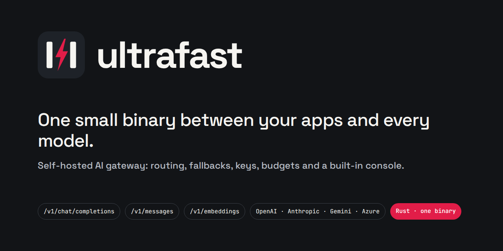

<p align="center"></p>

# Ultrafast Gateway

[](https://github.com/techgopal/ultrafast-ai-gateway/actions)
[](rust-toolchain.toml)
[](LICENSE)

Ultrafast is one small Rust binary that sits between your apps and your LLM
providers. It speaks the OpenAI and Anthropic APIs, adds an admin API, and
serves a built-in web console, with SQLite for storage and nothing else to
run. It is for small teams who host it themselves. This is v2; the v1 code is
tagged `v1-final`. Design: [`docs/superpowers/specs/2026-09-28-gateway-v2-design.md`](docs/superpowers/specs/2026-09-28-gateway-v2-design.md).

## Features

- **Endpoints.** `/v1/chat/completions`, `/v1/messages` (Anthropic format),
  `/v1/embeddings`, `/v1/models`; streaming on both chat formats.
- **Providers.** OpenAI and any OpenAI-compatible API, Anthropic, Gemini,
  Azure OpenAI. Credentials are encrypted at rest with a master key.
- **Routing and resilience.** Routes with weighted targets, ordered fallbacks,
  retries, timeouts and circuit breakers; an exact-match response cache.
- **Access control.** Email and password sign-in, roles (admin, team lead,
  member), teams, virtual keys with expiry and an allowlist of models and
  routes, a model catalog with enable and grant rules, an audit log.
- **Usage, logs, limits, budgets.** Request logs (metadata only; no prompt or
  answer is stored) with retention, tags, usage and spend reports, prices per
  model, rate limits (requests, tokens, concurrency) and budgets (block or
  alert) for the gateway, teams, users and keys.
- **Console.** Overview, logs, playground, providers, models, routing, keys,
  users, teams, limits, settings; light and dark themes, phone layout. Compiled
  into the binary; no Node at runtime.
- **Metrics.** Prometheus at `/metrics` (opt in, token protected).
- **Operations.** Online backup, configuration export and import, a CLI for
  setup, an OpenAPI description of the admin API.
- **Clients.** Rust, Python and TypeScript, sharing one Rust core.

Not yet (phase 2): guardrails, MCP tools, single sign-on, alerts by email or
webhook, OpenTelemetry export, an admin SDK, Postgres, tools and images in
chat.

## Quickstart

Build the console and the gateway (Node 22 with pnpm, Rust 1.94):

```bash
pnpm --dir ui install --frozen-lockfile && pnpm --dir ui build
cargo build --release -p ultrafast-gateway
```

Or use Docker (the image builds both; it listens on 3000 and keeps its data in
the volume `/var/lib/ultrafast`):

```bash
docker build -t ultrafast .
docker run -p 3000:3000 -v ultrafast-data:/var/lib/ultrafast \
  -e UF_ADMIN_EMAIL=you@example.com -e UF_ADMIN_PASSWORD='a long password' ultrafast
```

Start it. `UF_ADMIN_EMAIL` and `UF_ADMIN_PASSWORD` create the first admin when
there is no user yet (password 12 to 256 characters); without them the console
asks you to create the first admin on first visit.

```bash
UF_DATA_DIR=./data UF_ADMIN_EMAIL=you@example.com UF_ADMIN_PASSWORD='a long password' \
  ./target/release/ultrafast serve
```

Then, in the console at <http://127.0.0.1:3000> (plain HTTP works on localhost):

1. **Providers**, Add: a name, a kind (`openai`, `anthropic`, `gemini`,
   `azure`), the base URL (for example `https://api.openai.com/v1`) and the API key.
2. **Models**: sync the provider's models, enable the ones you want and grant
   them (to everyone, or to teams and users). Nothing is callable until it is
   enabled and granted.
3. **Virtual keys**, Create: the key (`uf-sk-...`) is shown once.

Call it with a model written `provider/model`:

```bash
curl http://127.0.0.1:3000/v1/chat/completions \
  -H "Authorization: Bearer $UF_KEY" -H "Content-Type: application/json" \
  -d '{"model":"openai/gpt-4o","messages":[{"role":"user","content":"Say hi."}]}'
```

```python
from openai import OpenAI
client = OpenAI(base_url="http://127.0.0.1:3000/v1", api_key=UF_KEY)
client.chat.completions.create(model="openai/gpt-4o", messages=[{"role": "user", "content": "Say hi."}])
```

```python
from anthropic import Anthropic
client = Anthropic(base_url="http://127.0.0.1:3000", api_key=UF_KEY)  # the SDK adds /v1/messages
client.messages.create(model="anthropic/claude-sonnet-5", max_tokens=256,
                       messages=[{"role": "user", "content": "Say hi."}])
```

The gateway accepts the key as `Authorization: Bearer` or `x-api-key`.

The same setup from the command line (no console), against the same data
directory:

```bash
export UF_DATA_DIR=./data
UF_PROVIDER_API_KEY=sk-... ./target/release/ultrafast provider add \
  --name openai --kind openai --base-url https://api.openai.com/v1
./target/release/ultrafast model add --provider openai --model gpt-4o --enable --everyone
./target/release/ultrafast key create --name my-app     # printed once
```

A running gateway picks up CLI changes within 30 seconds; changes through the
console or `/api` apply at once.

## Configuration

There is no config file. Everything is a flag or an environment variable
(`ultrafast --help`, `ultrafast serve --help`). Prefer the variable for
secrets: a flag shows in the process list.

| Variable | Flag | Default | Meaning |
| --- | --- | --- | --- |
| `UF_DATA_DIR` | `--data-dir` | `./data` (`/var/lib/ultrafast` in the image) | Directory of the database (`gateway.db`) and `master.key`. Any subcommand. |
| `UF_MASTER_KEY` | `--master-key` | generated into `master.key` | 64 hex characters; encrypts provider credentials. Any subcommand. |
| `UF_HOST` | `--host` | `127.0.0.1` (`0.0.0.0` in the image) | Address to listen on. `serve`. |
| `UF_PORT` | `--port` | `3000` | Port to listen on. `serve`. |
| `UF_ADMIN_EMAIL` | none | unset | With `UF_ADMIN_PASSWORD`: create the first admin at start when no user exists. Setting only one is an error. `serve`. |
| `UF_ADMIN_PASSWORD` | none | unset | See above. 12 to 256 characters. |
| `UF_INSECURE_COOKIES` | `--insecure-cookies` | off | Send the session cookie without `Secure`, for plain HTTP on a trusted network or while developing. |
| `UF_TRUSTED_PROXIES` | `--trusted-proxy CIDR` (repeatable) | none | Networks of reverse proxies whose `CF-Connecting-IP` and `X-Forwarded-For` are believed. Comma separated in the variable. |
| `UF_METRICS_TOKEN` | `--metrics-token` | unset | Enables `GET /metrics` for callers sending this bearer token. |
| `UF_PROVIDER_API_KEY` | `--api-key` | unset | `provider add` only: the provider's API key. |
| `RUST_LOG` | none | `info` | Log filter. |

For the dev tooling only: `UF_DEV_GATEWAY` (where `pnpm --dir ui dev` proxies
to) and `UF_E2E_BINARY` (the binary the browser tests run).

Subcommands: `serve`, `provider add`, `model add`, `key create`,
`backup <path>`, `config export|import <file>`, `openapi`.

## Using the gateway

- **Models.** Call `provider/model` (for example `anthropic/claude-sonnet-5`)
  or the name of a route. `GET /v1/models` lists what the key may call.
- **Access.** A model is callable when it is enabled, granted to the caller
  (everyone, or a team or user they belong to), and, if the key has an
  allowlist, on that list. Routes follow the same idea. A call that fails these
  rules is refused.
- **Tags.** Send `x-uf-tags: {"job":"nightly","env":"dev"}` on chat, messages
  or embeddings calls (at most 20 tags; names `A-Z a-z 0-9 _ . -`; names and
  values 1 to 64 characters; header at most 1 KiB; never forwarded to the
  provider). Keys can carry tags too, set by an admin; on the same name the
  key's tag wins. Logs filter with `GET /api/logs?tag=env:prod`, usage groups
  with `GET /api/usage?group=tag:team`.
- **Errors.** Rate limits and `block` budgets answer 429 with `Retry-After`
  (budgets: `budget_exceeded`). Errors use the shape of the endpoint called
  (OpenAI or Anthropic).
- **Cache.** A route can cache answers (TTL 1 to 86 400 s; shared per team, key
  or user). Streams and temperature above 0.5 are never cached.
- **Prices and budgets.** A model without a price is logged without a cost, so
  spend is a lower bound. Budgets are per UTC day, week (from Monday) or month.
- **Admin API.** `/api/*`, described by [`openapi/admin.json`](openapi/admin.json)
  (also `ultrafast openapi`). Sign in with a session, or send an access token
  (`uf-at-...`, from Account) as a bearer token.

## Console

Served at `/`. What each role sees is decided by the API.

| Page | Admin | Team lead | Member |
| --- | --- | --- | --- |
| Overview, Logs | all | their teams' and own | own |
| Playground | yes | yes | yes |
| Providers | manage | view | view |
| Models, Routing | manage | see what they may use | see what they may use |
| Virtual keys | any user's | own and their teams' members' | own |
| Users | invite, role, status, delete | their teams' members | themselves |
| Teams | create, delete, leads | rename, add members | see own teams |
| Budgets and limits | set | read their teams' | read what applies to them |
| Settings (retention, sign-in, backup, config, audit log) | yes | no | no |
| Account (name, password, access tokens) | yes | yes | yes |

Guardrails and MCP tools appear in the navigation as coming.

## Operations

**Backup.** A consistent copy of the database while it runs: Settings, Backup;
`GET /api/backup` (admin); or

```bash
ultrafast --data-dir ./data backup ./backups/ultrafast-2026-10-04.db   # the file must not exist
```

It holds users, sessions, logs, the audit log and encrypted provider
credentials, but not the master key. Without `master.key` (or `UF_MASTER_KEY`)
it is useless: keep that key safe, apart from the backups.

**Restore.** Stop the gateway cleanly, keep the old files, put the backup in
place, start:

```bash
mv data/gateway.db data/gateway.db.before
[ -e data/gateway.db-wal ] && mv data/gateway.db-wal data/gateway.db.before-wal
[ -e data/gateway.db-shm ] && mv data/gateway.db-shm data/gateway.db.before-shm
cp backups/ultrafast-2026-10-04.db data/gateway.db && chmod 600 data/gateway.db
```

The gateway must have the master key of the one the backup came from.

**Configuration export and import.** Moves the setup, not the data: providers
(without credentials), models and grants, routes, teams, gateway/team/user
limits and budgets, settings. Settings, Configuration in the console (with a
dry run first), `GET /api/config/export` and `POST /api/config/import`, or:

```bash
ultrafast --data-dir ./data config export ./config.json          # file must not exist
ultrafast --data-dir ./other config import ./config.json --dry-run
ultrafast --data-dir ./other config import ./config.json
```

A file with errors is refused whole. An import creates and updates by name and
never deletes; new providers have no credential until an admin sets one.

**Upgrade.** Stop, replace the binary (or image), start: migrations run at
start. Back up first. Coming from `2.0.0-alpha.1`: existing providers work only
after an admin syncs, enables and grants their models (console, Models, or
`ultrafast model add --provider NAME --model ID --enable --everyone`); until
then calls to `NAME/MODEL` are refused.

**Metrics.** Set `UF_METRICS_TOKEN`, then scrape `GET /metrics` with
`Authorization: Bearer <token>`. Without a token the path does not exist; a
wrong token is 401.

```yaml
scrape_configs:
  - job_name: ultrafast
    authorization: { credentials_file: /etc/prometheus/ultrafast-token }
    static_configs: [{ targets: ["127.0.0.1:3000"] }]
```

Series: `uf_requests_total{endpoint,status_class}`, `uf_tokens_total{direction}`,
`uf_cost_micros_total`, `uf_upstream_duration_seconds{provider}`,
`uf_cache_hits_total`, `uf_cache_misses_total`, `uf_rate_limited_total{limit}`,
`uf_budget_blocked_total`, `uf_circuit_open{provider,model}`,
`uf_log_records_dropped_total`, `uf_log_write_failures_total`. No label names a
key, user, team or prompt. `GET /health` answers `{"status":"ok"}`.

**Reverse proxy and Cloudflare.** Start with `--trusted-proxy CIDR` (or
`UF_TRUSTED_PROXIES`) so sign-in limiting counts the client's address, not the
proxy's. The proxy must set or overwrite `CF-Connecting-IP` and
`X-Forwarded-For` itself and never pass on what the client sent; never list a
network clients can reach directly. Without it, 20 failed sign-ins from anyone
behind a proxy block sign-in for everyone for 15 minutes.

**HTTPS and cookies.** The session cookie is `Secure`, so the console needs
HTTPS except on localhost; over plain HTTP elsewhere the browser drops the
cookie and the sign-in page says so. Terminate TLS at the proxy, or on a
trusted network use `--insecure-cookies`. `/v1` with a key works over HTTP.

## Clients

Rust, Python and TypeScript clients for the gateway (or a provider directly),
built on one Rust core, `ultrafast-translate`, and tested with shared fixtures
(`clients/fixtures/`). They do not retry, route or cache; an error says
whether to retry and when. Wheels and an npm package are not published yet:
build from source as each README says.

Rust ([`crates/client`](crates/client/README.md)):

```rust
use ultrafast_client::{ChatRequest, Client, Target};

let client = Client::new(Target::gateway("http://127.0.0.1:3000", key));
let reply = client.chat(ChatRequest::new("anthropic/claude-sonnet-5").user("Say hi.")).await?;
println!("{}", reply.content);
```

Python ([`crates/client-py`](crates/client-py/README.md)):

```python
import ultrafast

client = ultrafast.Client(ultrafast.gateway("http://127.0.0.1:3000", key))
reply = client.chat("anthropic/claude-sonnet-5", [{"role": "user", "content": "Say hi."}])
print(reply.content)
```

TypeScript ([`clients/ts`](clients/ts/README.md)):

```ts
import { Client, gateway } from "@ultrafast/client";

const client = new Client(gateway({ baseUrl: "http://127.0.0.1:3000", key }));
const reply = await client.chat({ model: "anthropic/claude-sonnet-5", messages: [{ role: "user", content: "Say hi." }] });
console.log(reply.content);
```

All three also stream and make embeddings, and send `tags` as `x-uf-tags`.

## Known limits

- Rate limits, budgets, the response cache and routing health live in the
  memory of one process: they start empty (budgets are rebuilt from the logs)
  and are not shared between processes. One gateway per database.
- A `block` budget can be overshot: spend is counted when the log writer
  prices a call (batches of about a second), and a long call is charged when
  it ends.
- A stream whose caller left, or that failed midway, is charged an estimate
  (marked Estimated in the logs).
- Creating or revoking a key, or changing teams, users, routes, providers,
  models or grants, clears the whole response cache. There is no
  single-flight: concurrent misses all go to the provider.
- Request logs keep metadata only. Logs of a deleted user or team stay, with no
  owner.
- Only admins set limits and budgets; nobody sees another person's spend. A
  budget alert is an audit entry, not an email or a webhook.
- A backup restore is manual, and a configuration import never deletes.
- Text chat only: no tools or images. SQLite only.
- The image is linux/amd64; the crates are not on crates.io.

## Development

Release builds embed `ui/dist`, so build the console first (as in Quickstart).
A plain `cargo build` works without Node: `/` then says the console was not
built, while `/api`, `/v1`, `/health` and `/metrics` work.

```bash
cargo run -p ultrafast-gateway -- serve --port 3001 --insecure-cookies   # your own port
pnpm --dir ui dev                                                        # UF_DEV_GATEWAY=http://127.0.0.1:3002 for another port
```

Tests:

```bash
cargo fmt --all -- --check
cargo clippy --all-targets --all-features -- -D warnings
cargo test --all
pnpm --dir ui lint && pnpm --dir ui typecheck && pnpm --dir ui test
pnpm --dir ui exec playwright install chromium
pnpm --dir ui build && cargo build --release -p ultrafast-gateway && pnpm --dir ui test:e2e
```

CI (`.github/workflows/`): `ci.yml` (lint, tests, OpenAPI is current, image),
`clients.yml`, and `release.yml` (a tag `v*` that names the version in
`Cargo.toml` makes a draft GitHub release with binaries for Linux x86_64 and
aarch64, macOS x86_64 and arm64 and Windows x64, and pushes
`ghcr.io/techgopal/ultrafast-ai-gateway`).

Layout:

| Path | Contents |
| --- | --- |
| `crates/gateway` | The binary: API, `/v1` proxy, store, migrations |
| `crates/translate` | Request and response translation shared with the clients |
| `crates/client`, `crates/client-py`, `crates/client-wasm`, `clients/ts` | Rust, Python, WebAssembly core and TypeScript clients |
| `ui/` | React console |
| `openapi/admin.json` | Generated admin API description |
| `docs/` | [`CONVENTIONS.md`](docs/CONVENTIONS.md), design spec, plans, brand |

Contributors: read [`docs/CONVENTIONS.md`](docs/CONVENTIONS.md) first. After
changing an admin route, regenerate the spec with
`cargo run -p ultrafast-gateway -- openapi > openapi/admin.json`. Security
reports: see [`SECURITY.md`](SECURITY.md).

## License

MIT, see [`LICENSE`](LICENSE).
